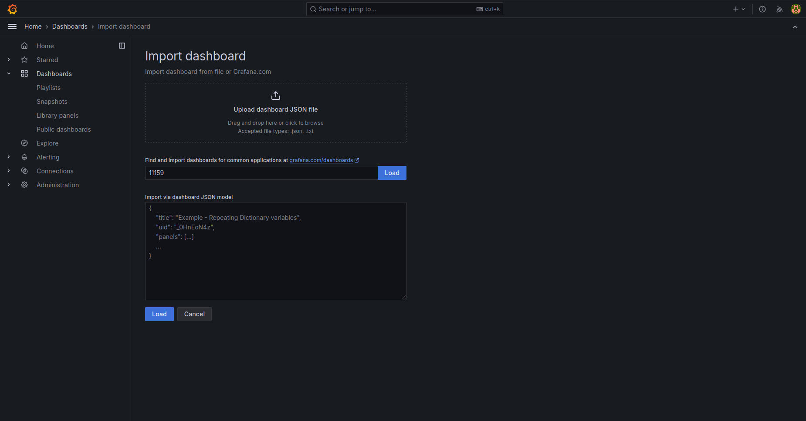
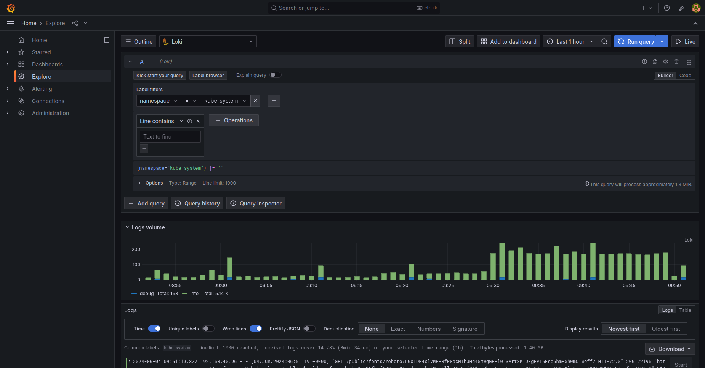
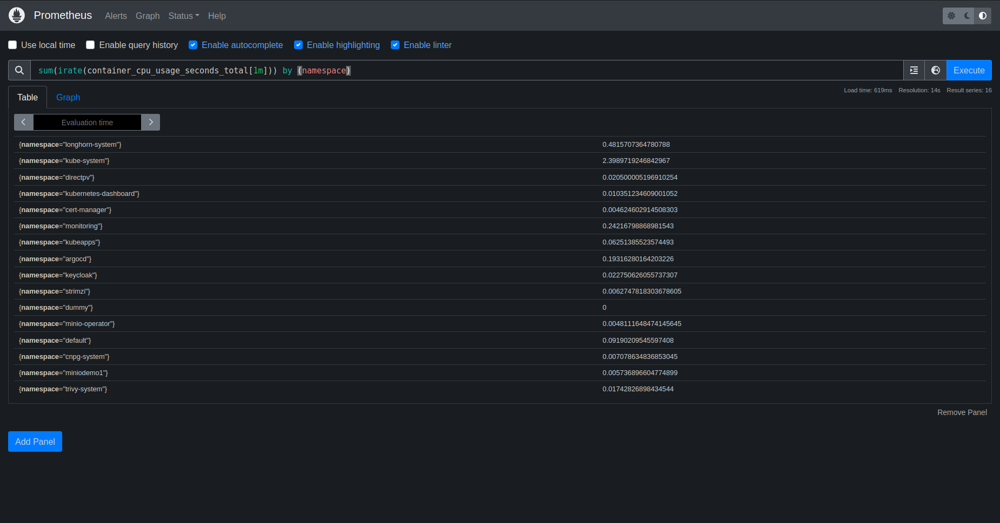
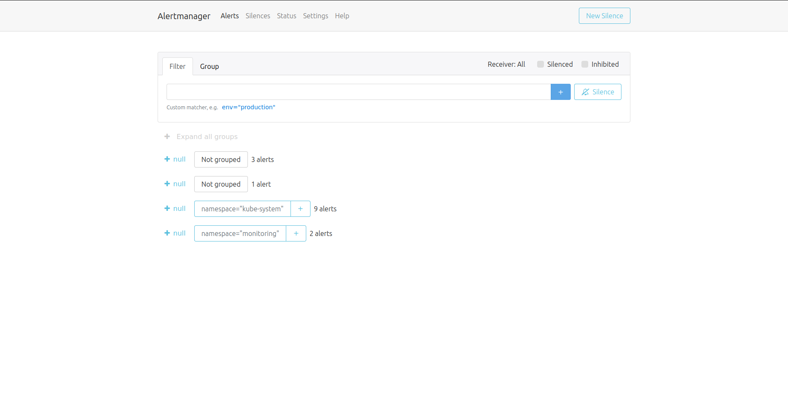
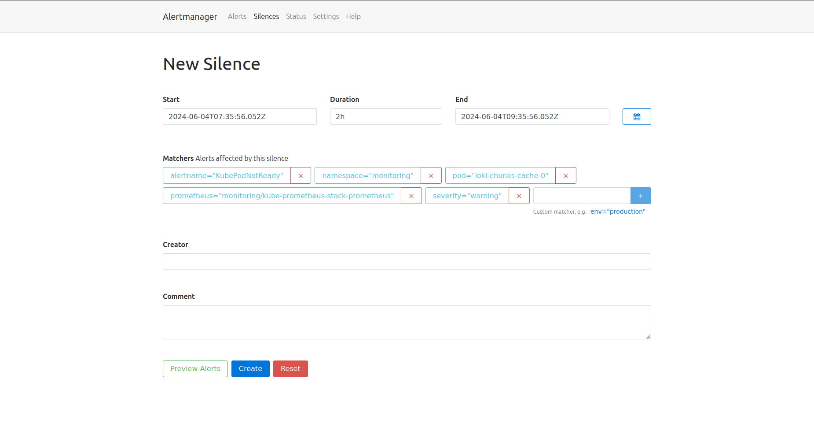

# Monitoring

For monitoring, 
[kube-prometheus-stack](https://github.com/prometheus-community/helm-charts/tree/main/charts/kube-prometheus-stack), 
[Loki](https://github.com/grafana/loki/tree/main/production/helm/loki) 
and [Promtail](https://github.com/grafana/helm-charts/tree/main/charts/promtail) 
can be installed, using Helm charts. 

kube-prometheus-stack includes Grafana, Prometheus and Alertmanager.

## Install

They will require Longhorn (or other default storage class).

To check status:

```
$ kubectl -n monitoring get pods
NAME                                                        READY   STATUS    RESTARTS   AGE
alertmanager-kube-prometheus-stack-alertmanager-0           2/2     Running   0          16h
kube-prometheus-stack-grafana-8449db8684-tppzl              3/3     Running   0          16h
kube-prometheus-stack-kube-state-metrics-7f6967956d-m6pm9   1/1     Running   0          16h
kube-prometheus-stack-operator-6f565678b9-p4wrk             1/1     Running   0          16h
kube-prometheus-stack-prometheus-node-exporter-55vrt        1/1     Running   0          16h
kube-prometheus-stack-prometheus-node-exporter-sd6fb        1/1     Running   0          16h
kube-prometheus-stack-prometheus-node-exporter-wsf96        1/1     Running   0          16h
loki-0                                                      1/1     Running   0          2m3s
loki-canary-9kpt6                                           1/1     Running   0          2m3s
loki-canary-l7hlb                                           1/1     Running   0          2m3s
loki-canary-m7qf8                                           1/1     Running   0          2m3s
loki-chunks-cache-0                                         0/2     Pending   0          2m3s
loki-gateway-775bc49657-qks5z                               1/1     Running   0          2m3s
loki-results-cache-0                                        2/2     Running   0          2m3s
prometheus-kube-prometheus-stack-prometheus-0               2/2     Running   0          16h
promtail-2skxc                                              1/1     Running   0          116s
promtail-t2kn8                                              1/1     Running   0          116s
promtail-xqmm5                                              1/1     Running   0          116s
```

To install:

```
ansible-playbook 490-kube-prometheus-stack.yaml 
ansible-playbook 491-loki.yaml
ansible-playbook 492-grafana-ingress.yaml 
```

## Grafana 

Grafana is a multi-platform open source analytics and interactive visualization web application. It can produce charts, graphs, and alerts for the web when connected to supported data sources such as Prometheus or Loki.

For more details, check the product documentation: https://grafana.com/docs/grafana/latest/
### Graphical User Interface

Its user interface can be accessed `https://grafana.<external-dns>`.

Admin credentials can be obtained from the `grafana-credentials` secret:

```
kubectl -n monitoring get secret grafana-credentials  -o jsonpath="{.data.admin-user}" | base64 --decode
kubectl -n monitoring get secret grafana-credentials  -o jsonpath="{.data.admin-password}" | base64 --decode
```

Grafana comes pre-installed with some Dashboards which you can preview in the Dashboards menu on the left:


You can add a new Grafana dashboard from [Grafana's Dashboard marketplace](https://grafana.com/grafana/dashboards/) from the New button in the top right, pressing Import Dashboard and adding the dashboard ID:



To query Loki for logs go to the Explore menu and choose Loki as the datasource:




## Prometheus

Prometheus is a set of open-source tools for monitoring and alerting in containerized and microservices-based environments. Prometheus uses pull requests to retrieve information. It works by sending HTTP scrape requests, then parses and stores the responses to scrape requests alongside the relevant Kubernetes metrics. Prometheus uses a custom database to store cluster information, allowing it to handle large volumes of data.


For more details, check the product documentation: https://prometheus.io/docs/introduction/overview/

### Graphical User Interface

Prometheus' user interface is not exposed via an Ingress object by default, for accessing it use `kubectl port-forward`:

```
kubectl port-forward -n monitoring svc/kube-prometheus-stack-prometheus 9090:9090
```

Then open `http://localhost:9090` in your browser.

You can do a manual query by typing it in the Expression field then clicking Execute:



## Loki

Loki is a log aggregation system inspired by Prometheus. It is designed to be very cost effective and easy to operate. It does not index the contents of the logs, but rather a set of labels for each log stream.

For more details, check the product documentation: https://grafana.com/docs/loki/latest/

### Promtail

Promtail is an agent which ships the contents of local logs to the Loki instance. It primarily discovers targets, attaches labels to log streams and pushes them to the Loki instance.

## Alertmanager

Alertmanager handles alerts sent by client applications such as the Prometheus server. It takes care of deduplicating, grouping, and routing them to the correct receiver integration such as email, PagerDuty, or OpsGenie. It also takes care of silencing and inhibition of alerts.

For more details, check the product documentation: https://prometheus.io/docs/alerting/latest/alertmanager/

### Graphical User Interface

Alertmanager's user interface is not exposed via an Ingress object by default, for accessing it use `kubectl port-forward`:

```
kubectl port-forward -n monitoring svc/kube-prometheus-stack-alertmanager 9093:9093
```

Then open `http://localhost:9093` in your browser.





To silence an alert, expand an alert group, press Silence on the alert and then choose the duration and creator:



